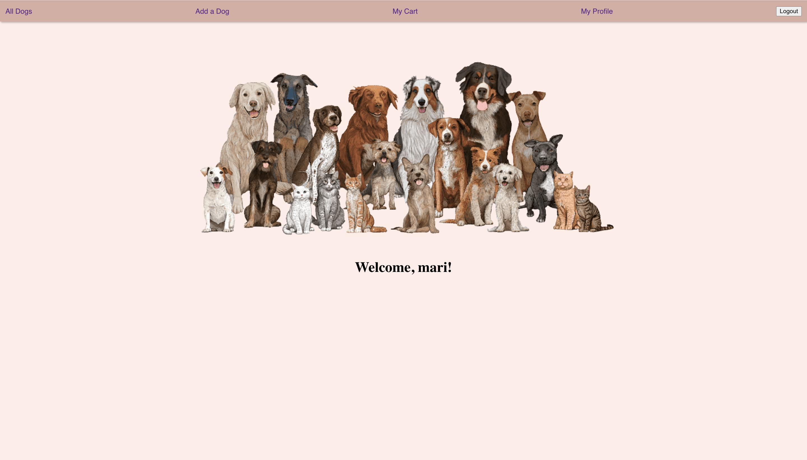
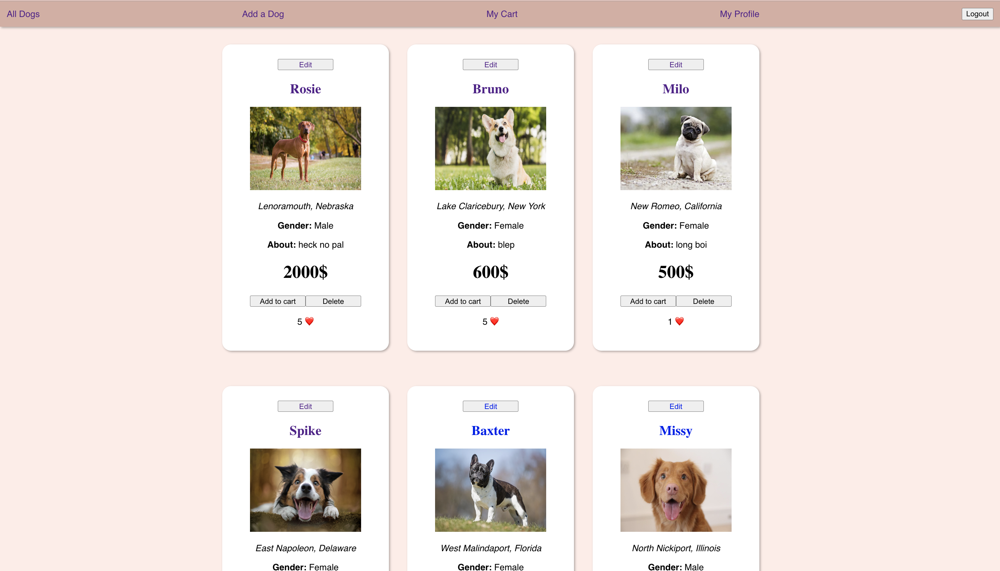
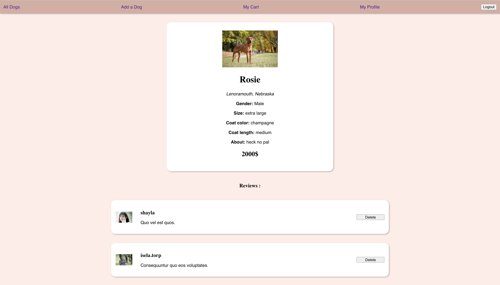
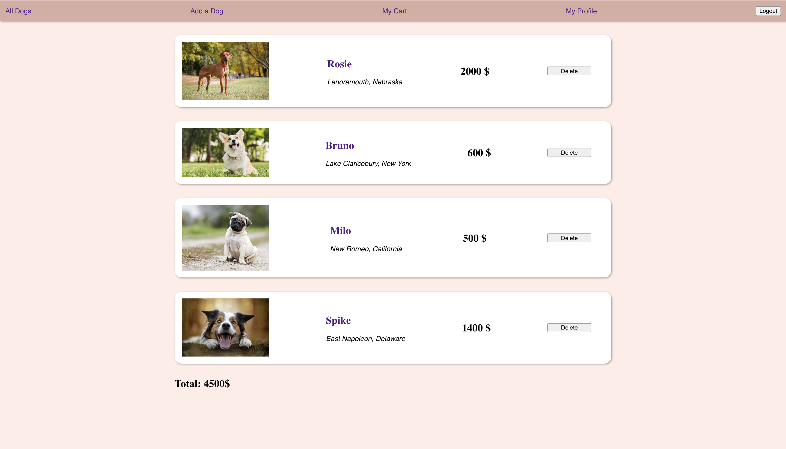
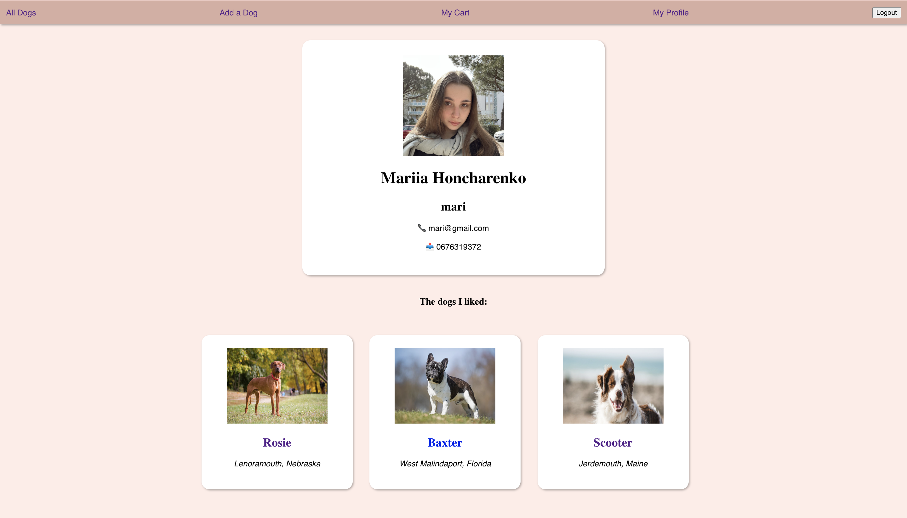

# Dog Store
## Capstone project in Flatiron School
The dog app is a database of dogs that can be bought and sold.

Walkthrough video: [https://www.youtube.com/watch?v=0EOrfRqWhBk](https://www.youtube.com/watch?v=0EOrfRqWhBk)

## User is able to:

* Signup/login/logout
* View a list of the dogs, add new dogs, edit or delete existing ones

* View, add, delete reviews on dogs

* Like dogs
* Add dogs to shopping cart

* See liked dogs
* See their own profile

## Owner:
* [Mariia Honcharenko](https://github.com/mmmaariieee)